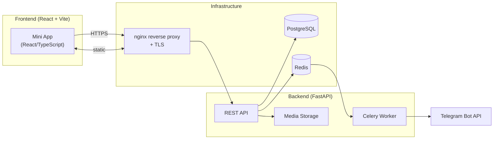

# Wishfox – Telegram Mini App

[Русская версия](#russian) • [English version](#english)

---

## <a id="russian"></a>🇷🇺 Русская версия

### О проекте

Wishfox — уютное мини-приложение Telegram для ведения списков желаний. Добавляйте мечты с приоритетами и ценами, делитесь подборками с друзьями и следите за обновлениями через встроенный бот.

### Почему это удобно

- 📱 Родной интерфейс Telegram Mini Apps.
- 🔄 Сортировка drag‑and‑drop, теги, фильтры и поиск.
- 🖼️ Загрузка изображений и авто-заполнение карточки по ссылке (Open Graph).
- 🤝 Подписки на других пользователей и умные уведомления через Celery.
- 🌗 Две локали (RU/EN) и поддержка тёмной темы Telegram.

### Архитектура

```mermaid
flowchart LR
    subgraph Client ["Frontend (React + Vite)"]
        App["Mini App\n(React/TypeScript)"]
    end

    subgraph Back["Backend (FastAPI)"]
        API["REST API\nAuth / Wishes / Feed / ..."]
        Worker["Celery worker\nTelegram уведомления"]
        Media["Media storage\n(локально)"]
    end

    subgraph Infra["Инфраструктура"]
        DB[(PostgreSQL)]
        Cache[(Redis)]
        Nginx["nginx reverse proxy\n+ TLS"]
    end

    Telegram["Telegram Bot API"]

    App -- HTTPS --> Nginx
    Nginx -- proxied --> API
    API -- SQLAlchemy --> DB
    API -- Redis queue --> Worker
    Worker -- Bot token --> Telegram
    API -- файловая система --> Media
    App <-- статический контент -- Nginx
```

### Стек

| Слой          | Технологии                                                                          |
|---------------|--------------------------------------------------------------------------------------|
| Frontend      | React, Vite, TypeScript, i18next, Telegram WebApp SDK                               |
| Backend       | FastAPI, SQLAlchemy, Pydantic, Celery, Redis, PostgreSQL, Alembic                   |
| Инфраструктура| Docker Compose, nginx, GitHub Actions, Make, smoke-скрипт                           |

### Быстрый старт

```bash
cp .env.example .env        # заполните секреты
make up                     # сборка и запуск всех сервисов
make logs                   # стрим логов
```

Дополнительно:

| Команда        | Назначение                                   |
|----------------|----------------------------------------------|
| `make down`    | остановить стек                              |
| `make lint`    | линтеры & форматеры (backend + frontend)     |
| `make test`    | pytest для backend                           |
| `make seed`    | демо-данные (также есть кнопка в UI)         |
| `scripts/smoke.sh` | быстрый health-check docker compose      |

### Настройка окружения

- `BOT_TOKEN` — токен бота от @BotFather.  
- `SECRET_KEY`, `CSRF_SECRET` — подпись сессий и CSRF токенов.  
- `POSTGRES_*`, `REDIS_URL` — соединения с БД и Redis.  
- `MEDIA_ROOT` — путь для загружаемых изображений (мапится в контейнер).

Файлы сертификатов (`yafoxin.ru_cert.pem`, `yafoxin.ru_private_key.pem`) монтируются nginx как `fullchain.pem` и `privkey.pem`. После замены выполните `docker compose restart nginx`.

### Telegram-конфигурация

1. Создайте бота (`/newbot`) и получите токен.  
2. `/setmenubutton` → Web App → `https://ваш-домен/?tgWebAppStartParam=<username>`.  
3. `/setdomain` → укажите домен.  
4. Обновите `.env`, перезапустите стек.  
5. Для подробностей см. `README.botfather.ru.md`.

### API и функциональность

- `/auth/telegram` — авторизация через init data Telegram.  
- `/me`, `/users/{handle}` — профиль пользователя.  
- `/wishlists`, `/wishes` — CRUD желаний, drag-and-drop сортировка.  
- `/subscriptions` — подписки, фолловеры.  
- `/feed` — лента действий.  
- `/notifications` — очередь уведомлений.  
- `/media/upload` — загрузка изображений.  
- `/links/preview` — парсер Open Graph.

### Тестирование и CI

- Backend: `make test` (pytest + fakeredis).  
- Frontend: `npm run lint`, `npm run build`.  
- CI (GitHub Actions) запускает линтеры и сборку при каждом push/PR.

### Структура репозитория

```
backend/        # FastAPI приложение, Celery, Alembic миграции, тесты
frontend/       # Vite + React SPA (Telegram Mini App)
nginx/          # конфигурация reverse proxy
media/          # загрузки (volume)
scripts/        # smoke тесты, утилиты
docker-compose.yml
```

---

## <a id="english"></a>🇬🇧 English version

### Overview

Wishfox is a Telegram Mini App that keeps your wishlist organised. Add wishes with priorities and prices, share collections with friends, and receive smart notifications via the companion bot.

### Highlights

- 📱 Native Telegram Mini App UX.  
- 🔄 Drag & drop ordering, tags, filters, search.  
- 🖼️ Image uploads and automatic link previews (Open Graph).  
- 🤝 Follow friends and receive Celery-powered notifications.  
- 🌗 Bilingual (RU/EN) and dark-mode ready.

### Architecture



### Tech stack

| Layer        | Technologies                                                                          |
|--------------|----------------------------------------------------------------------------------------|
| Frontend     | React, Vite, TypeScript, i18next, Telegram WebApp SDK                                 |
| Backend      | FastAPI, SQLAlchemy, Pydantic, Celery, Redis, PostgreSQL, Alembic                     |
| Infrastructure | Docker Compose, nginx, GitHub Actions, Make, smoke scripts                         |

### Quick start

```bash
cp .env.example .env      # configure secrets
make up                   # build & run services
make logs                 # tail logs
```

Handy targets:

| Command        | Purpose                                      |
|----------------|----------------------------------------------|
| `make down`    | stop the stack                               |
| `make lint`    | run linters/formatters for both stacks       |
| `make test`    | run backend pytest suite                     |
| `make seed`    | load demo data                               |
| `scripts/smoke.sh` | quick docker health check                |

### Environment

- `BOT_TOKEN` — your Telegram bot token.  
- `SECRET_KEY`, `CSRF_SECRET` — session & CSRF signing.  
- `POSTGRES_*`, `REDIS_URL` — database connections.  
- `MEDIA_ROOT` — upload directory mapped inside the container.

TLS certificates (`yafoxin.ru_cert.pem`, `yafoxin.ru_private_key.pem`) are mounted into nginx as `fullchain.pem` and `privkey.pem`. Afterwards run `docker compose restart nginx`.

### Telegram setup

1. Create a bot via @BotFather and keep the token.  
2. `/setmenubutton` → Web App → `https://your-domain/?tgWebAppStartParam=<username>`.  
3. `/setdomain` → specify the domain.  
4. Update `.env` and restart the stack.  
5. See `README.botfather.ru.md` for advanced tips.

### API highlights

- `/auth/telegram` — Telegram init data auth.  
- `/me`, `/users/{handle}` — profile endpoints.  
- `/wishlists`, `/wishes` — CRUD with drag-and-drop ordering.  
- `/subscriptions` — follow / unfollow.  
- `/feed` — activity timeline.  
- `/notifications` — queue inspection.  
- `/media/upload` — image uploads.  
- `/links/preview` — Open Graph metadata fetcher.

### Testing & CI

- Backend: `make test` (pytest + fakeredis).  
- Frontend: `npm run lint`, `npm run build`.  
- GitHub Actions run lint/format/test/build on every push & PR.

### Repository layout

```
backend/        # FastAPI app, Celery worker, migrations, tests
frontend/       # Vite + React SPA tailored for Telegram
nginx/          # reverse proxy configuration
media/          # uploads volume
scripts/        # smoke/utility scripts
docker-compose.yml
```

---

**Готово! / Done!**  
Если вы нашли ошибку или хотите предложить улучшение — создайте issue или pull request 🙌
